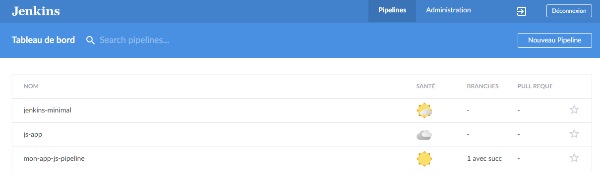
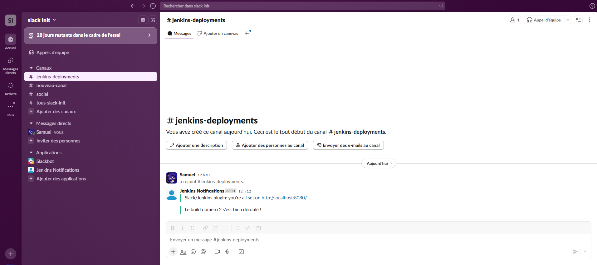
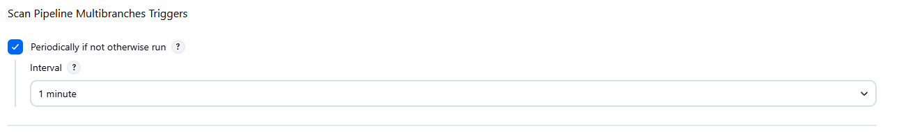
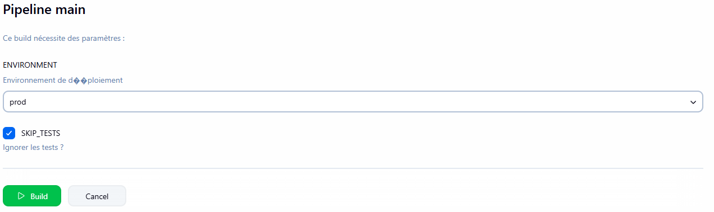
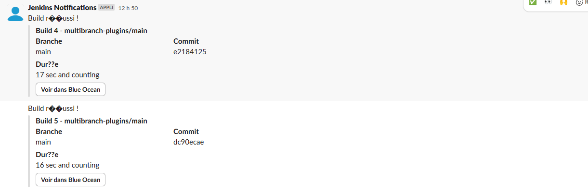

# Rendu TP : Intégration de Plugins Jenkins (Blue Ocean, Gitea, Slack)

## 1. Installation des plugins
- Plugins installés : **Blue Ocean**, **Gitea**, **Slack**

## 2. Découverte de l'interface Blue Ocean
- L'interface Blue Ocean semble plus ancienne, mais la création de pipeline est plus intuitive et facile à prendre en main.
- Exemple d'interface :
  

## 3. Intégration de Slack dans Jenkins
- J'ai eu un soucis avec la connexion qui ne se faisait pas à cause d'un espace dans le nom du workspace.
- Solution : utilisation de l'ID du workspace dans la configuration Slack.
- Exemple de configuration :
  
- Je trouve ça vraiment pratique d'avoir cette intégration. Dans ma boite, la vérification des builds se fait manuellement, donc cette intégration serait une vraie amélioration, a voir si c'est pertinent et faisable sur teams.

## 4. Intégration de Gitea
- Création d'un token GitHub pour relier Jenkins au dépôt.
- Après configuration, chaque nouveau push déclenche automatiquement un build.
- Mise à jour du Jenkinsfile pour inclure de nouvelles étapes de déploiement (j'ai copié collé le jenkinsfile dans ce repo) :
  - Configuration des choix de l'environnement de déploiement
  - Utilisation de `env.ENVIRONMENT` et `env.SKIP_TESTS` pour exécuter dynamiquement certains stages
  - Ajout d'une notification Slack évoluée avec des boutons
- Exemples :
  
  
  
  
- Après coup je me suis rendu compte que je n'avais pas testé l'intégration avec Gitea, j'ai simplement utilisé Git pour la gestion du code.